## Introductie
Sluit de Arduino pas aan op de computer met de USB kabel nadat je een circuit hebt gebouwd. Haal de kabel er weer uit voor je iets verandert aan het circuit.

## De onderdelen
De **_Arduino Uno_** heeft een aantal verschillende aansluitingen: de voeding (plus en aarde), digitale in- en uitgangen, en analoge in-en uitgangen.
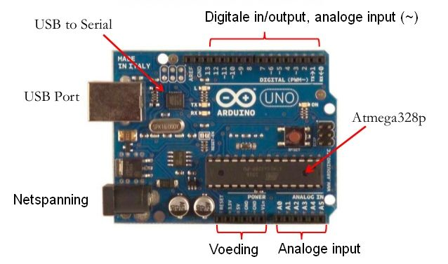

- Met de voeding kun je het circuit dat je hebt gebouwd van stroom voorzien.
- Met de digitale in- en uitgangen kun je **_aan_** en **_uit_** opdrachten geven, bijvoorbeeld of een LED aan of uit moet staan. Dit zijn aansluitingen 2 t/m 13
- Met de analoge ingangen kun je de waarden van bijvoorbeeld licht- of temperatuursensoren meten (die zijn niet beperkt tot 0 (uit) of 1 (aan). Dit zijn aansluitingen A0 t/m A5.
- Met de analoge uitgangen (dit zijn de digitale aansluitingen die gemerkt zijn met een ~) kun je bijvoorbeeld een LED harder of zachter laten branden.

Je kunt een circuit bouwen op een zogenaamd **_breadboard_**. Deze zijn er in allerlei soorten en maten. Op dit schema kun je zien welke gaatjes (elektrisch) met elkaar verbonden zijn.
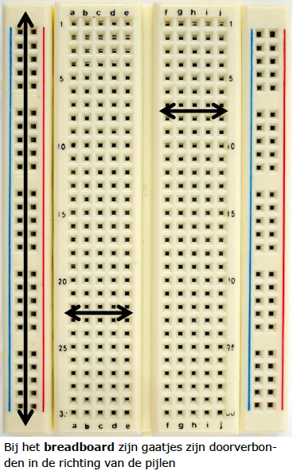

## Opdrachten
### Code uploaden naar de Arduino
Als je een stuk code hebt gemaakt in mBlock, klik je met de rechtermuisknop op het Arduino programma.
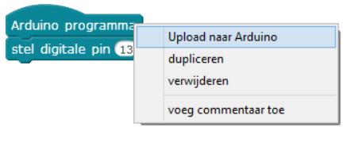

De code die naar de Arduino geupload moet worden komt tevoorschijn. Klik nu op Upload naar Arduino.
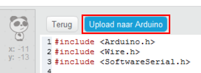

### Voorbeeldopdracht 1: knipperende LED
1. Maak het volgende circuit (met behulp van een breadboard).

2. Schakel nu de LED in door de juiste output op HOOG te zetten.

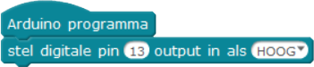

3. Nu wil je dat de LED daarna ook weer uit gaat.

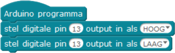

4. Er zit geen tijd tussen het aan- en uitgaan!

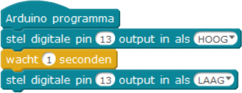

5. Nu wil je dit blijven herhalen.

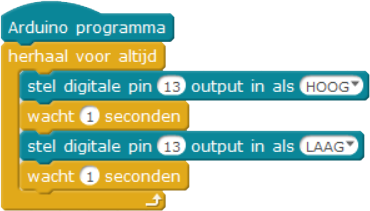


### Voorbeeldopdracht 2: metronoom (Grove kit)
1. Sluit het LCD scherm, de variabele weerstand en de buzzer aan op de juiste poorten.
2. Laat de buzzer elke seconde (of zoiets) een geluidje maken.

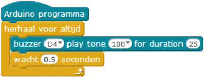

3. Lees de waarde van de variabele weerstand af om deze vervolgens te kunnen vertalen naar een snelheid voor de metronoom.

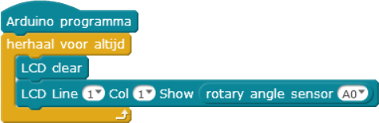

4. Combineer nu de buzzer en variabele weerstand!

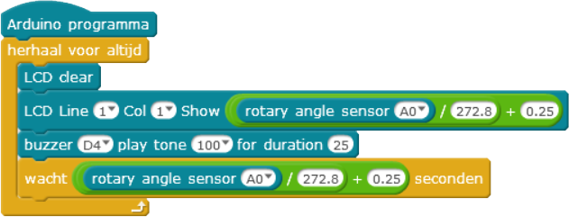


## Uitdagingen
- Stoplicht met schakelaar
- Lichtkrant (Grove, met LCD schermpje)
- Licht- of donkerwijzer (met servo motor)
- Thermometer (met temperatuursensor)

## Bronnen
- https://www.arduino.cc/en/Tutorial/BlinkWithoutDelay
- Project: http://www.makeuseof.com/tag/arduino-traffic-light-controller/
- Schakelaar: http://oscarromero-arduino.weebly.com/pull-down-weerstand.html
- https://github.com/josejuansanchez/37-in-1-arduino-sensor-kit/tree/master/001
- https://github.com/Seeed-Studio/Sketchbook_Starter_Kit_for_Arduino
- http://wiki.seeed.cc/Grove_Starter_kit_for_Arduino_101/
- [Breadboard](http://oscarromero-arduino.weebly.com/les-1-breadboard.html)
- [Elementen](https://sites.google.com/site/arduinodojo/voor-coaches)

