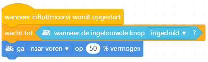
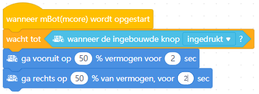

## Introductie
Voor je de mBot aanzet: de mBot eerst op de grond zetten of op de kop leggen!

Hou rekening met de beperkte ruimte: laat het vermogen van de wielen eerst gewoon op 50% staan.

Ook handig om te weten:
1. Je kunt de taal instellen via de wereldbol. De volgende instructies gaan uit van Nederlandse blokken.
2. Je vindt de mBot bij Apparaten; bij Sprites staan de afbeeldingen die je op het scherm ziet (in het voorbeeld dus de panda).
3. Net als bij Scratch staan de blokken per soort bij elkaar. Neem even de tijd om te kijken wat voor blokken er in de verschillende menu's staan. Waar vind je bijvoorbeeld de als... dan... blokken?
4. Je kunt de mBot live programmeren terwijl deze met de computer verbonden is, of programma's uploaden> naar het geheugen van de mBot. De live manier is makkelijk als je aan het uitproberen bent hoe dingen werken, na uploaden kun je de mBot loskoppelen van de computer.

## De mBot met de computer verbinden
1. Start mBlock.
2. Sluit de mBot aan met de USB-kabel en zet de robot aan.
3. Verwijder bij het tabblad Apparaten eventuele andere robots, klik op toevoegen en kies dan de mBot.
4. Klik nu op verbinden, begin met de Live stand.
5. Test of de verbinding gelukt is, bijvoorbeeld door op dit element te (dubbel)klikken:  
6. Je bent nu klaar om een programma te gaan schrijven!

## De input en output van de mBot

### Voelen (met de sensoren)
De mBot heeft een aantal sensoren om z'n omgeving te voelen.
- **Ultrasoon**: dit zijn de twee 'ogen' voorop de mBot. De mBot gebruikt net als een vleermuis echo's om voorwerpen te 'zien'. Het ene oog stuurt een geluidje en het andere oog vangt de echo op.
- **Lijnvolg**: voor het voorwiel zitten twee sensoren die het verschil tussen licht en donker kunnen meten. Als de mBot over een lijn rijdt kan hij op deze manier zien of er een bocht aankomt.
- **Lichtsterkte**: bovenop (onder het plastic kapje) zit een sensor die meet hoe licht het in de ruimte is.
### Doen (met de actuatoren)
- **Motoren**: ieder wiel wordt met een aparte motor bestuurd.
- **LEDs**: bovenop (onder het plastic kapje) zitten twee LEDs die je elke kleur kunt maken die je wilt.
- **Buzzer**: ook onder het kapje zit een buzzer waarmee je de mBot verschillende hoogte tonen kunt laten maken.

## Opdrachten
### Voorbeeldopdracht 1: een vierkant rijden
Aangezien de mBot bij dit programma moet rijden is het verstandig je programma naar de mBot te uploaden en het programma te starten als deze op de grond staat. Je kunt het programma laten starten bij het aanzetten van de mBot; in dit voorbeeld start het programma als de knop bovenop wordt ingedrukt.
1. De eerste stap is om de mBot een stuk vooruit te laten rijden. 50% van het vermogen is prima om mee te beginnen. Start het programma door op het zwarte knopje bovenop de mBot te drukken.



2. Nu rijdt de mBot eindeloos door! Zorg dus dat deze na een paar seconden weer stopt met rijden.



3. Laat nu de mBot een bocht maken. Probeer de tijd zo in te stellen dat ie rechtsaf (of linksaf) slaat.



4. Dit stuk code wil je nu een aantal keer herhalen.



### Voorbeeldopdracht 2: sensorwaarden laten zien
Om opdrachten te kunnen programmeren is het vaak handig om te weten wat de sensoren van de mBot meten. Om dit te kunnen zien moet je de gemeten waarde bewaren in een variabele. Kijk bijvoorbeeld wat de lichtsensor meet als je je hand bovenop de mBot houdt, of de ultrasoonsensor als je je hand heen en weer beweegt voor de mBot.
1. Maak eerst een variabele aan voor lichtsterkte en/of afstand. Je kunt zelf kiezen of andere sprites deze variabele ook mogen zien en gebruiken.



2. Wijs nu de waarde gemeten door de sensor toe aan deze variabele. Als je nu het programma uitvoert zie je dat linksboven in het scherm de gemeten waarde(n) getoond worden. "mBot:" voor lichtsterkte geeft aan dat deze variabele alleen voor de mBot beschikbaar is.



3. De LEDs op de mBot kunnen beïnvloeden wat de lichtsensors meten, zet daarom eerst de LEDs uit.



4. Waarschijnlijk wil je de waarde(n) van de sensor(s) meer dan één keer bepalen. Herhaal daarom deze stap. Vaak is het ook verstandig een kleine pauze na iedere herhaling in te bouwen.



### Voorbeeldopdracht 3: help, een muur!
In deze opdracht is het de bedoeling om te voorkomen dat de mBot tegen de muur botst (nadat je 'm er wel naar toe laat rijden natuurlijk).
1. Begin weer met de mBot te laten rijden na het indrukken van de knop.



2. Maak nu een voorwaarde waarbij de mBot bij een afstand van minder dan 20 centimeter stopt met rijden.



3. Gebeurt er nu wat je wil? Zo niet, denk dan eens na waarom niet? Heb je een stukje code vergeten?



4. Sla maar eens flink alarm met licht en geluid om duidelijk te maken dat de mBot bijna gebotst was! Natuurlijk kan dit op veel manieren, de voorbeeldcode is er daar één van.




## Uitdagingen
Hier nog een paar uitdagingen waar je aan kunt werken. Ze beginnen makkelijk en worden steeds moeilijker.

Ga zelf aan de gang! Natuurlijk kun je zelf iets verzinnen voor de mBot, hier zijn wat ideeën voor als je inspiratie nodig hebt:
- Rijd een achtje (of extra moeilijk: een spiraal)
- Lichten aan in de tunnel
- Aan de slag als politieauto of ambulance
- Volg de lijn
- Ontwijk de voorwerpen
- Volg een voorwerp

